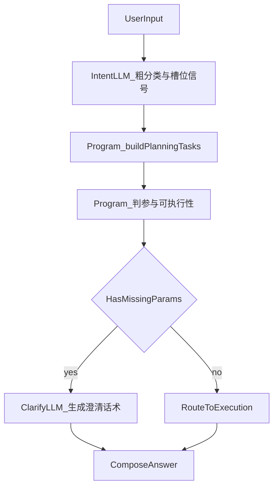

# 意图识别三阶段改造计划

## 目标
把链路改成你提的三步（并纳入 **planningTasks 由程序生成**）：
1) 首轮 LLM **不做**最终 `planningTasks` 结构；只做粗意图分类、目标描述、可选槽位/信号（如 `segmentId`、候选 guide id 提示等，具体以契约为准）。
2) **内部程序**根据首轮输出 + 系统配置 + Skill/Guide 目录，**生成** `planningTasks[]`（含 `taskId`、`systemModuleId`、`goal`、`skillSteps`、`selectedSkillId/kind`、步骤顺序与依赖占位）。
3) 对 `data_query`（及同模式模块）由程序判参、判定可执行性并填充 `missingSlots` / `missingParams` / `executable` / `planPhase`。
4) 仅在缺参时再调用一次轻量 LLM 生成澄清话术（写入 `clarificationQuestion`）。

## 可行性结论
可行，而且与现有编排结构天然匹配：
- `intent_agent -> plan_gate -> ... -> compose_answer` 已有阶段化节点。
- 现有 `composeAnswerNode` 已基于 `missingSlots/missingParams` 走澄清分支。
- 只需把“缺参判断主导权”从首轮 LLM 下放到程序后处理，并新增一个“澄清文案生成器”。

## 关键缺失项（需补）
- **规划生成规则**：如何从「粗意图 + 槽位」映射为 1..N 个 `planningTasks`（顺序、依赖、何时拆多任务）。需要可测试的规则表或小型状态机，避免隐性靠 LLM。
- **候选技能收敛**：内部程序如何从 `domain/segment`、关键词、或 LLM 给出的**候选 id 列表**选出唯一/有序 guide（与现有 `listSkillsByDomainSegment` / `getGuide` 能力对齐）。
- `data_query` 的**参数词典与别名映射**统一源（当前分散在 `guideAgentNode` 等处）。
- **requiredParams 来源**统一：以 Guide `params.required` 为准，避免 LLM 随机写必填项。
- 缺参判定后对 `IntentResult` 的**回写策略**（根级与 task/step 级字段一致性）。
- 澄清生成失败时的**降级话术**与超时策略。
- 观测指标：`intent_llm_ms`、`deterministic_planning_ms`、`clarify_llm_ms`、命中率/追问率。

## 实施步骤
- 在 [`src/agents/intentClassifyAgent.ts`](src/agents/intentClassifyAgent.ts) 收窄首轮输出职责：
  - 定义新的轻量 schema（或收紧 prompt）：**禁止**模型输出完整 `planningTasks`（或仅允许 `draftHints` 类非权威字段，最终丢弃）。
  - 首轮只产出：`intents[]`（类型/goal/confidence）、可选 `resolvedSlots`、可选 `segmentId/domainId`、可选 `candidateEntryIds` 等。
- 新增 **DeterministicPlanningTasksBuilder**（建议 [`src/graph/orchestrator/planGateNode.ts`](src/graph/orchestrator/planGateNode.ts) 或 `src/planning/` 下独立模块）：
  - 输入：首轮 LLM 输出 + `userInput` + `getSkillCatalog`/`listGuides`；
  - 输出：完整 `planningTasks[]` + `skillSteps[]`（程序生成 `taskId`、写入 `systemModuleId=data_query` 等）；
  - 多任务顺序与依赖：由规则配置驱动（可先支持单任务，再扩展链式）。
- 新增“程序化判参与可执行性填充”模块（可与上一步同一遍历）：
  - 针对 `data_query`：按选中 guide 读取 `params.required`，结合 `resolvedSlots`/别名映射判缺参；
  - 回写 `planningTasks[].missingSlots/executable` 与 `skillSteps[].missingParams/executable`；
  - 统一设置根级 `planPhase` 与 `needsClarification`。
- 新增“缺参澄清文案生成”轻量调用：
  - 仅当程序判定缺参时触发；输入 `goal + missingSlots/missingParams + locale`；
  - 输出写入 `clarificationQuestion`，失败则回退模板文案。
- 对接现有合成节点 [`src/graph/orchestrator/composeAnswerNode.ts`](src/graph/orchestrator/composeAnswerNode.ts)：
  - 优先使用新生成 `clarificationQuestion`；
  - 保持现有 blocked/clarification 路由不变。
- 更新契约与文档：
  - [`src/contracts/intentSchemas.ts`](src/contracts/intentSchemas.ts) 注释改为“缺参字段以后处理为准”；
  - [`skills/guides/plan/intent-planning-decompose-and-orchestrate.md`](skills/guides/plan/intent-planning-decompose-and-orchestrate.md) 调整为“三阶段职责边界”。

## 数据流（目标态）

## 验收标准
- 首轮意图 LLM 平均耗时下降（目标 20%+）；输出 token 更少（不再生成大段 planningTasks JSON）。
- 相同用户输入下 **`planningTasks` 结构由程序稳定生成**（可单测覆盖）。
- `data_query` 缺参判定在相同输入下可复现（同输入同结论）。
- 缺参场景下澄清文案可读且字段准确（不再出现“漏问/乱问”）。
- 不缺参场景不触发二次 LLM 澄清调用。
