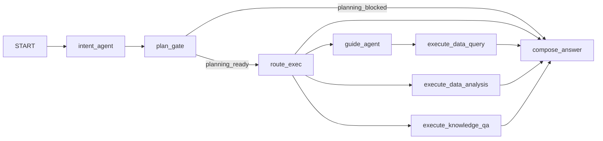

# 意图识别与编排重构规划（方案 B）

## 目标与约束

- **单轮 invoke 内两阶段**：先 **规划节点**（无副作用），再 **执行子图**（guide → data_query / analysis / knowledge_qa 等）。
- **规划完成前不执行**：在规划未通过（缺参、需澄清、或计划未锁定）时，**不进入** `guide_agent` / 各 `execute_*` 节点，**不写入** [`OrchestratorState.resultsIndex`](d:\code\hc-agent-system\src\contracts\schemas.ts)（及等价副作用）。
- **多维度域模型**（与现有 [`systemConfig`](d:\code\hc-agent-system\src\config\systemConfig.ts) 对齐）：
  - **任务切分（system-module）**：用 `facets` 含 `system-module` 的 domain 列表（[`listSystemModuleDomains`](d:\code\hc-agent-system\src\config\systemConfig.ts)）驱动「跨模块多任务」。
  - **执行步骤（skills + segments）**：用 `facets` 含 `skills` 的 domain + segment（[`listSkillsDomains`](d:\code\hc-agent-system\src\config\systemConfig.ts) / [`listSkillsSegments`](d:\code\hc-agent-system\src\config\systemConfig.ts)）+ [`catalog`](d:\code\hc-agent-system\src\lib\skills\catalog.ts) 渐进披露候选，再落到具体技能/guide id。
- **一轮对话多任务、跨 DOMAIN**：规划输出 **任务数组**；每条任务绑定 `systemModuleId`（或等价枚举）+ 可选多条 skills 步骤。
- **澄清**：与分割、步骤规划 **同一轮** 完成槽位检查；输出 **追问语言**（与用户输入语言一致或显式字段，见下）。
- **输出契约**：每条任务或每步定义 **返回数据形态**（table / object / summary 等）与 **后续动作**（如写 artifact、回调渠道、触发子 Agent）。

## 现状与差距

- 主图 [`orchestratorGraph.ts`](d:\code\hc-agent-system\src\graph\orchestrator\orchestratorGraph.ts) 在 `intent_agent` 后按 `dominantIntent` / `needsClarification` / `missingSlots` **直接进入** `guide_agent` 或 `execute_*`，**没有**独立的「仅规划」门闸。
- [`intentSchemas.ts`](d:\code\hc-agent-system\src\contracts\intentSchemas.ts) 已有 `intents[]`、`taskPlan`，但 **缺少**系统模块与 skills 双层结构、**缺少**规划通过标志、**缺少**澄清语言字段。

## 数据模型（建议）

在 **Intent 结果**（或并列 `OrchestratorState` 字段）中增加：

- `planPhase`: `"draft" | "ready" | "blocked"`（或 `planReady: boolean` + `needsClarification`）
- `planningTasks[]`（名称可定为 `moduleTasks`）：
  - `taskId`, `systemModuleId`（对应 system-module 域 id）
  - `goal`, `resolvedSlots`, `missingSlots`, `clarificationQuestion?`
  - `skillSteps[]`: `skillsDomainId`, `skillsSegmentId`, `disclosedSkillIds[]`（L1）→ `selectedEntry`（L2，skill/guide id）
  - `expectedOutput`, `followUpActions[]`（结构化小枚举 + 参数）
- `replyLocale` 或 `clarificationLanguage`：`"zh" | "en" | "auto"`（`auto` = 与 `userInput` 一致）
- 若需与现有字段兼容迁移期：保留 `taskPlan` 作调试/预览，**以 `planningTasks` + `planPhase` 为路由真源**（逐步收敛）。

## 图编排（方案 B 落地）

- **`plan_gate` 节点**（新建，或合并进 `intent_agent` 末尾的纯函数）：
  - 输入：最新 `intentResult` +（可选）`getSystemConfig()` 元数据
  - 逻辑：若 `planPhase !== "ready"` 或 `needsClarification` 或任一任务缺必填槽 → **仅** `compose_answer`（不走路由执行边）
  - 若 `planPhase === "ready"` → 按 `dominantIntent` / 任务队列路由到 `guide_agent` 或各 `execute_*`（与现逻辑对齐，但 **以规划任务为准**）

- **副作用边界**：`execute_*` 节点才写 `resultsIndex`；`plan_gate` 与 `compose_answer` 不写。

## Prompt / 工具（渐进披露）

- **System 注入**（规划阶段）：
  - `listSystemModuleDomains()` 摘要表
  - `listSkillsDomains()` / `listSkillsSegments()` 摘要表
  - 可选：从 [`catalog`](d:\code\hc-agent-system\src\lib\skills\catalog.ts) 按 `(skillsDomain, skillsSegment)` 拉 Top-K 条目（L1）
- **规则**：先定 `moduleTasks`，再为每条任务选 `skillSteps`；缺参时 **同一次 JSON** 填 `missingSlots` + `clarificationQuestion`（语言由 `replyLocale` 约束）。

## 合成与渠道

- [`composeAnswerNode`](d:\code\hc-agent-system\src\graph\orchestrator\composeAnswerNode.ts)：blocked 时优先展示 **计划草案 + 缺参追问**；ready 且执行后走现有 `data_query` / `task_plan` 分支。
- [`wecomReplyFormat`](d:\code\hc-agent-system\src\lib\channels\wecom\wecomReplyFormat.ts)：必要时增加 `planning` / `plan_blocked` 类型（若与 `task_plan` 分离）。

## 验收要点

- 单轮 invoke：**规划失败** → 仅 `compose_answer`，`resultsIndex` 不变。
- 单轮 invoke：**规划成功** → 同 invoke 内进入执行节点，`resultsIndex` 有值。
- 单条用户输入含 **2+ system-module 任务**：`planningTasks.length >= 2`，且路由策略明确（串行执行或先主任务；需在实现时选默认：**按 `dominantIntent` 主任务先执行** 或 **并行占位**，建议首版 **串行**）。

## 用户已选节奏

- **B**：同一轮 invoke 内先规划，通过后同 invoke 再执行；执行前不写 `resultsIndex`。
