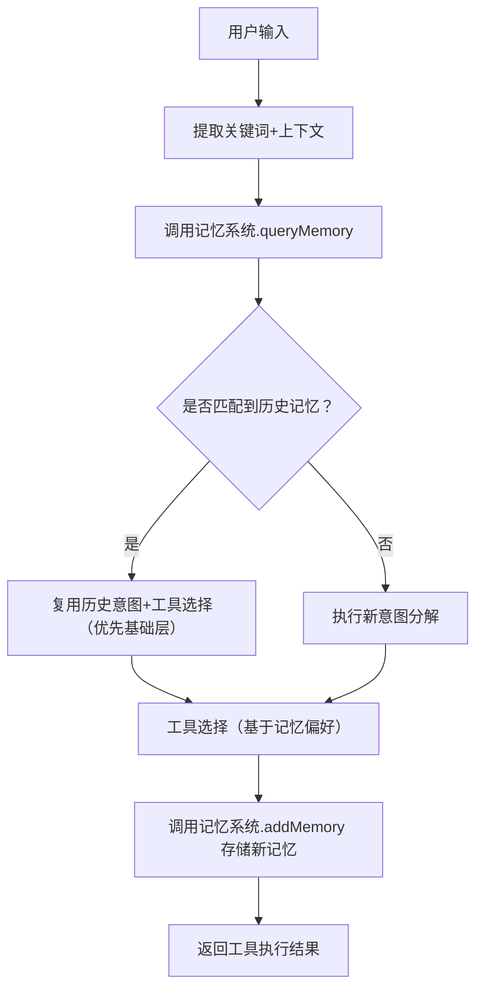

# 意图识别模块记忆系统设计方案
## 一、设计背景与核心目标
意图识别模块的记忆系统核心目标是让智能体**记住历史交互中的关键信息**，并基于记忆优化意图分解、工具选择的准确性，同时兼容“工具渐进式披露”的核心逻辑。具体要解决：
1. 避免重复识别相同意图（如用户多次问“查销售数据”，无需重复分解）；
2. 结合历史上下文补全意图（如用户先问“上周数据”，再问“环比”，能关联上下文）；
3. 记忆工具选择的历史偏好（如用户偏好使用基础层的`calculator`工具，后续优先推荐）；
4. 支持记忆的新增、查询、更新、清理，保证数据可控。

## 二、核心设计原则
1. **分层记忆**：区分「短期会话记忆」（单次交互）和「长期用户记忆」（跨会话），适配不同场景；
2. **轻量化存储**：只记忆核心信息（意图、工具选择、上下文），不冗余存储原始对话；
3. **兼容渐进式披露**：记忆中关联工具分层信息，优先复用基础层工具的历史选择；
4. **可追溯/可清理**：每个记忆条目带时间戳，支持按时间/关键词清理，避免内存溢出。

## 三、记忆系统核心结构
### 1. 数据模型定义（TS类型）
```typescript
// 基础类型：意图记忆条目
interface IntentMemoryItem {
  // 唯一标识
  id: string;
  // 用户/会话ID（关联归属）
  userId: string;
  sessionId: string;
  // 核心意图（标准化）
  coreIntent: string;
  // 意图关键词（用于快速匹配）
  keywords: string[];
  // 上下文摘要（精简版历史对话）
  contextSummary: string;
  // 匹配的工具能力类型
  capabilityType: ToolCapabilityType;
  // 选中的工具及分层（关联渐进式披露）
  selectedTool: {
    name: string;
    layer: ToolLayer;
    matchScore: number;
  };
  // 时间戳（创建/更新）
  createTime: number;
  updateTime: number;
  // 记忆类型：短期/长期
  type: 'short-term' | 'long-term';
  // 过期时间（短期记忆默认30分钟，长期永久）
  expireTime?: number;
}

// 记忆系统配置
interface MemoryConfig {
  // 短期记忆过期时间（毫秒）
  shortTermExpire: number;
  // 最大记忆条目数（防止溢出）
  maxItems: number;
  // 是否自动清理过期记忆
  autoClean: boolean;
}
```

### 2. 记忆系统核心功能（类实现）
```typescript
import { v4 as uuidv4 } from 'uuid';
import { ToolCapabilityType, ToolLayer } from '../common/types';

export class IntentMemorySystem {
  // 内存存储（生产环境可替换为Redis/数据库）
  private memoryStore: IntentMemoryItem[] = [];
  // 配置项
  private config: MemoryConfig = {
    shortTermExpire: 30 * 60 * 1000, // 30分钟
    maxItems: 1000,
    autoClean: true,
  };

  constructor(config?: Partial<MemoryConfig>) {
    this.config = { ...this.config, ...config };
    // 启动自动清理定时器（每5分钟）
    if (this.config.autoClean) {
      setInterval(() => this.cleanExpiredMemory(), 5 * 60 * 1000);
    }
  }

  /**
   * 1. 新增记忆（核心方法）
   * @param params 记忆条目参数
   */
  addMemory(params: Omit<IntentMemoryItem, 'id' | 'createTime' | 'updateTime'>): IntentMemoryItem {
    // 1. 清理超出上限的旧记忆（FIFO）
    if (this.memoryStore.length >= this.config.maxItems) {
      this.memoryStore.shift();
    }

    // 2. 构建记忆条目
    const memoryItem: IntentMemoryItem = {
      id: uuidv4(),
      createTime: Date.now(),
      updateTime: Date.now(),
      ...params,
    };

    // 3. 存入存储
    this.memoryStore.push(memoryItem);
    return memoryItem;
  }

  /**
   * 2. 查询记忆（核心：匹配当前意图+上下文）
   * @param userId 用户ID
   * @param sessionId 会话ID
   * @param currentKeywords 当前意图关键词
   * @param capabilityType 目标工具能力类型
   */
  queryMemory(
    userId: string,
    sessionId: string,
    currentKeywords: string[],
    capabilityType?: ToolCapabilityType,
  ): IntentMemoryItem[] {
    // 过滤条件：归属+未过期+关键词匹配+能力类型（可选）
    const now = Date.now();
    return this.memoryStore.filter(item => {
      // 归属匹配（用户+会话）
      const isBelong = item.userId === userId && (item.sessionId === sessionId || item.type === 'long-term');
      // 未过期
      const isNotExpired = !item.expireTime || item.expireTime > now;
      // 关键词匹配（至少1个重合）
      const isKeywordMatch = currentKeywords.some(kw => item.keywords.includes(kw));
      // 能力类型匹配（可选）
      const isCapabilityMatch = !capabilityType || item.capabilityType === capabilityType;

      return isBelong && isNotExpired && isKeywordMatch && isCapabilityMatch;
    })
    // 排序：优先近期+基础层工具
    .sort((a, b) => {
      // 1. 按更新时间降序
      if (b.updateTime !== a.updateTime) return b.updateTime - a.updateTime;
      // 2. 按工具分层优先（基础层>进阶层>专家层）
      const layerPriority = { basic: 3, advanced: 2, expert: 1 };
      return layerPriority[b.selectedTool.layer] - layerPriority[a.selectedTool.layer];
    });
  }

  /**
   * 3. 更新记忆（如工具选择结果变化）
   * @param memoryId 记忆ID
   * @param updateData 待更新数据
   */
  updateMemory(memoryId: string, updateData: Partial<IntentMemoryItem>): boolean {
    const index = this.memoryStore.findIndex(item => item.id === memoryId);
    if (index === -1) return false;

    this.memoryStore[index] = {
      ...this.memoryStore[index],
      ...updateData,
      updateTime: Date.now(),
    };
    return true;
  }

  /**
   * 4. 清理过期记忆（自动/手动）
   */
  cleanExpiredMemory(): number {
    const now = Date.now();
    const beforeCount = this.memoryStore.length;
    this.memoryStore = this.memoryStore.filter(item => !item.expireTime || item.expireTime > now);
    return beforeCount - this.memoryStore.length; // 返回清理数量
  }

  /**
   * 5. 手动清理记忆（按用户/会话/类型）
   */
  cleanMemory(params: {
    userId?: string;
    sessionId?: string;
    type?: 'short-term' | 'long-term';
  }): number {
    const beforeCount = this.memoryStore.length;
    this.memoryStore = this.memoryStore.filter(item => {
      if (params.userId && item.userId !== params.userId) return false;
      if (params.sessionId && item.sessionId !== params.sessionId) return false;
      if (params.type && item.type !== params.type) return false;
      return true;
    });
    return beforeCount - this.memoryStore.length;
  }
}
```

## 四、记忆系统与意图识别模块的集成
### 1. 集成位置（核心流程）


### 2. 集成代码示例（意图分解核心类改造）
```typescript
// intentDecomposition/core/decomposer.ts
import { IntentMemorySystem } from './memory/intent-memory.system';

export class IntentDecomposer {
  // 注入记忆系统
  private memorySystem: IntentMemorySystem;

  constructor(llmClient: any, maxHistoryRounds: number = 8) {
    // 初始化记忆系统
    this.memorySystem = new IntentMemorySystem({
      shortTermExpire: 30 * 60 * 1000,
      autoClean: true,
    });
  }

  async decompose(
    intentResult: IntentRecognitionResult,
    historyMessages: HistoryMessage[],
    userId: string,
    sessionId: string,
  ): Promise<DecomposedStep[]> {
    // 步骤1：提取当前意图关键词
    const currentKeywords = intentResult.contextKeywords;

    // 步骤2：查询历史记忆
    const historyMemories = this.memorySystem.queryMemory(
      userId,
      sessionId,
      currentKeywords,
      intentResult.capabilityType, // 可选：按能力类型过滤
    );

    // 步骤3：复用历史记忆（如果有）
    if (historyMemories.length > 0) {
      const bestMemory = historyMemories[0];
      // 直接返回记忆中的分解步骤（无需重新调用LLM）
      return [
        {
          stepId: 1,
          stepContent: `复用历史意图：${bestMemory.coreIntent}`,
          requiredCapability: bestMemory.capabilityType,
          layerPriority: bestMemory.selectedTool.layer, // 复用分层偏好
          dependencies: [],
          backupStep: bestMemory.selectedTool.name,
        },
      ];
    }

    // 步骤4：无记忆则调用LLM分解（原有逻辑）
    const processedHistory = this.historyProcessor.process(historyMessages);
    const prompt = this.getDecompositionPrompt({
      coreIntent: intentResult.coreIntent,
      history: processedHistory,
      availableCapabilities: this.getAvailableCapabilities(),
    });
    const llmResponse = await this.llmClient.chat.completions.create({
      model: 'gpt-3.5-turbo',
      messages: [{ role: 'user', content: prompt }],
      temperature: 0.1,
      response_format: { type: 'json_object' },
    });

    // 步骤5：解析结果并存储记忆
    const parsedOutput = JSON.parse(llmResponse.choices[0].message.content || '{}');
    const decomposedSteps = parsedOutput.steps || [];

    // 存储新记忆（仅存储核心步骤）
    if (decomposedSteps.length > 0) {
      this.memorySystem.addMemory({
        userId,
        sessionId,
        coreIntent: intentResult.coreIntent,
        keywords: currentKeywords,
        contextSummary: processedHistory.substring(0, 200), // 精简上下文
        capabilityType: decomposedSteps[0].requiredCapability,
        selectedTool: {
          name: 'pending', // 工具选择后更新
          layer: decomposedSteps[0].layerPriority,
          matchScore: 0,
        },
        type: 'short-term', // 单次会话默认短期
        expireTime: Date.now() + this.memorySystem.config.shortTermExpire,
      });
    }

    return decomposedSteps;
  }
}
```

### 3. 工具选择后更新记忆
```typescript
// toolSelection/core/toolMatcher.ts
async matchSteps(steps: DecomposedStep[], userId: string, sessionId: string, memorySystem: IntentMemorySystem) {
  const toolResults = steps.map(step => {
    // 原有工具选择逻辑...
    return {
      stepId: step.stepId,
      selectedTool: bestTool.name,
      toolLayer: bestTool.layer,
      matchScore: matchScore,
      backupTool: sortedTools[1]?.name,
      stepContent: step.stepContent,
    };
  });

  // 更新记忆：把工具选择结果回填到记忆中
  const historyMemories = memorySystem.queryMemory(
    userId,
    sessionId,
    step.keywords,
    step.requiredCapability,
  );
  if (historyMemories.length > 0) {
    memorySystem.updateMemory(historyMemories[0].id, {
      selectedTool: {
        name: toolResults[0].selectedTool,
        layer: toolResults[0].toolLayer,
        matchScore: toolResults[0].matchScore,
      },
    });
  }

  return toolResults;
}
```

## 五、关键扩展与优化
### 1. 存储层扩展（生产环境）
- 开发环境：使用内存存储（上述实现）；
- 生产环境：替换为 Redis（推荐）/MySQL/MongoDB，通过`MemoryStore`接口抽象，不改动核心逻辑：
  ```typescript
  // 存储接口抽象
  interface MemoryStore {
    add(item: IntentMemoryItem): Promise<IntentMemoryItem>;
    query(filter: any): Promise<IntentMemoryItem[]>;
    update(id: string, data: Partial<IntentMemoryItem>): Promise<boolean>;
    clean(filter: any): Promise<number>;
  }

  // Redis实现示例
  export class RedisMemoryStore implements MemoryStore {
    constructor(private redisClient: RedisClient) {}
    // 实现接口方法...
  }
  ```

### 2. 长期记忆升级
- 短期记忆：默认30分钟，存储单次会话的临时意图；
- 长期记忆：用户手动标记（如`type: 'long-term'`），存储跨会话的高频意图（如“每周查销售数据”），可配置永不过期。

### 3. 记忆权重优化
- 给记忆条目增加「权重」字段，根据使用频率/匹配度动态调整，高频使用的记忆优先匹配。

## 六、总结
### 核心关键点
1. **分层记忆**：短期会话记忆（临时）+ 长期用户记忆（持久），兼顾性能与实用性；
2. **兼容渐进式披露**：记忆查询时优先排序基础层工具的历史记录，强化分层优先逻辑；
3. **轻量化+可扩展**：核心只存储意图、关键词、工具分层等关键信息，存储层可无缝切换到Redis/数据库；
4. **闭环流程**：记忆查询→复用/分解→存储/更新→自动清理，形成完整的记忆生命周期。

### 核心价值
- 减少重复的LLM调用（复用历史意图），提升意图识别效率；
- 结合上下文补全意图，降低用户输入成本；
- 记忆工具选择偏好，强化“基础层优先”的渐进式披露策略；
- 可管控的记忆生命周期，避免内存/存储溢出。